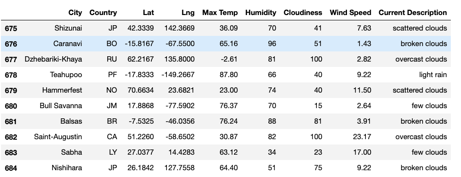

# World Weather Analysis

Our employer, ABC Travel, has asked us to generate latitude and longitude data and show weather data related to the corresponding city.  Some of the tools used for this challenge were Jupyter Notebook, Pandas Library, Googles Maps, CitiPy, Python Requests, APIs, and JSON Traversals. We applied analyses, visualizations, statistical skills, and utilized API data retrieval to complete three separate deliverables. 

## Results

### Deliverable 1:
The first deliverable was to generate 2000 random latitudes (lat) and longitudes (lng).  Once we were able to generate the lat and lng, we used the CitiPy module to figure out the nearest city.  Our API calls accessed weather data from OpenWeathermap.org.  After all the weather data was collected, we create a dataframe to store the data and wrote the dataframe to a CSV file for later use.  Please find below a snapshot of the TAIL of the dataframe.   I choose the tail to document how many cities were generated from the 2000 original lat/lng list. Since the lat/lng generated randomly, this dataframe will change each time the jupyter notebook is ran.   

### Deliverable 2:
### Deliverable 3:

## Summary
