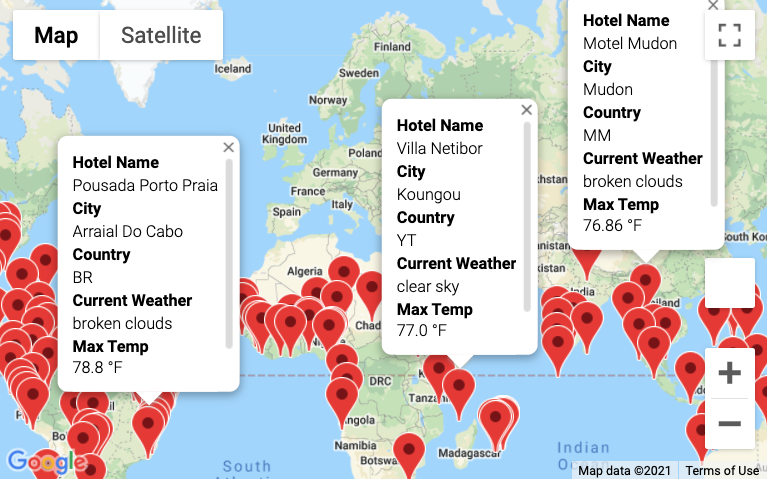
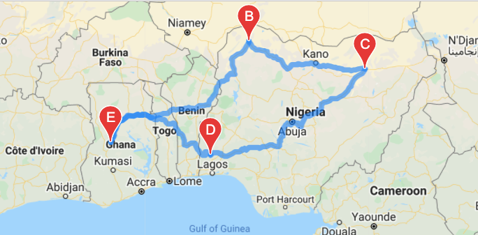
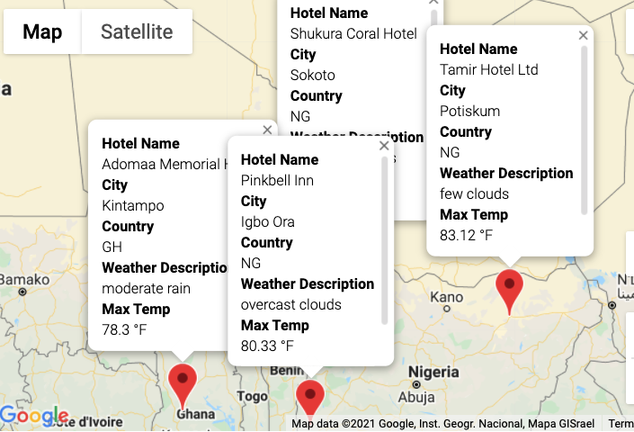

# World Weather Analysis

Our employer an online travel agency has asked us to generate latitude and longitude data and show weather data related to the corresponding city.  Some of the tools used for this challenge were Jupyter Notebook, Pandas Library, Googles Maps, CitiPy, Python Requests, APIs, and JSON Traversals. We applied analyses, visualizations, statistical skills, and utilized API data retrieval to complete three separate deliverables. 

## Results

### Deliverable 1:
The first deliverable was to generate 2000 random latitudes (lat) and longitudes (lng).  Once we were able to generate the lat and lng, we used the CitiPy module to figure out the nearest city.  Our API calls accessed weather data from OpenWeathermap.org.  After all the weather data was collected, we create a dataframe to store the data and wrote the dataframe to a CSV file for later use.  Please find below a snapshot of the TAIL of the dataframe.   I choose the tail to document how many cities were generated from the 2000 original lat/lng list. Since the lat/lng generated randomly, this dataframe will change each time the jupyter notebook is ran.   

### Deliverable 2:
In deliverable 1 we created a dataframe with numerous hotels and weather information.  That information is useful but not friendly to use with a customer is mostly concerned about weather during their vacation.  In the second deliverable we created a user input box allowing the customer to determine what kind of temperature they find suitable during their vacation.  After the min and max temperature ranges are determine we can execute the rest of the code to generate a dynamic map.  The map generated uses Google maps and includes a pop-up marker.  See below for an example of our Google Map:

### Deliverable 3:
Deliverable 3 builds on the scripts we used from Deliverable 1 and 2.  In this deliverable, I picked a few random cities to create an itinerary.  I used Google Maps Directions API to create a driving map from the cities selected.  After the driving itinerary was created, we regenerated the map with cities weather markers.  See below a few snapshots taken from my last generated itinerary.  

## Notes about future adjustments
I noticed it became difficult to display and center all the cities with their markers in the 3rd deliverable.  I believe it is due to choosing cities to close together.  This may be something I need to work out in the map display at a later time. 

